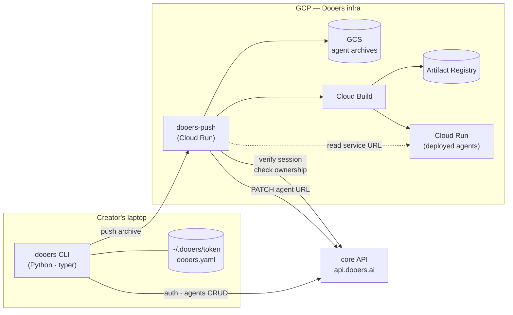
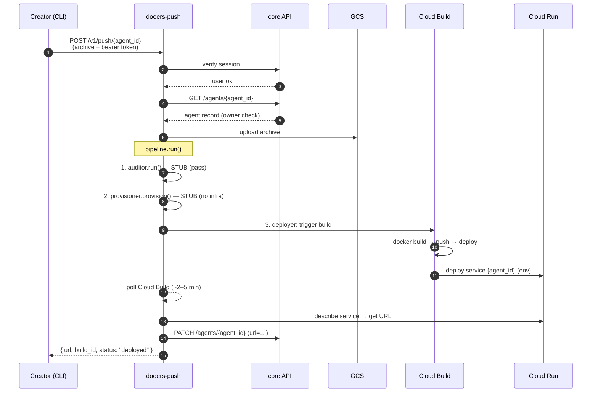

# Dooers Push — POC Overview

**Audience:** Stakeholders / product / leadership
**Status:** Draft for review
**Date:** 2026-05-26

---

## TL;DR

We are shipping a Proof of Concept of the **Dooers CLI v2** and the **`dooers-push`** service so that an agent creator can: authenticate from the terminal, list and create agents, and run `dooers push <agentID>` to upload code, build a container image, and get a live Cloud Run URL back — all without touching the GCP console.

The POC **deliberately defers** the harder open questions you raised (auditor logic, managed DB/Redis, billing) and ships them as **typed stub steps in the pipeline**, so we have a working end-to-end demo this sprint and a clean seam to plug in the real implementations later.

---

## What the creator does (terminal walkthrough)

```bash
# 1. Authenticate once (token saved to ~/.dooers/token)
$ dooers auth login --email creator@example.com
Verification code sent to your email.
> 482931
Authenticated as creator@example.com.

# 2. List the agents I own
$ dooers agents list
ID         NAME                   STATUS    URL
ag_8h2k    customer-support       deployed  https://customer-support-prod-xxx.run.app
ag_3m1p    invoice-parser         draft     —

# 3. Create a new agent record (writes dooers.yaml in cwd)
$ cd ~/code/my-new-agent
$ dooers agents create --name my-new-agent
Created ag_7q4r. dooers.yaml written.

# 4. Push the code — archive, audit (stub), provision (stub), build, deploy, return URL
$ dooers push
Reading dooers.yaml ............ ag_7q4r (my-new-agent)
Archiving ..................... 2.4 MB
Uploading ..................... done
Running pipeline ............... [auditor: ok] [provisioner: ok]
Building ...................... (~3 min) ✓
Deploying ..................... ✓
Live at: https://my-new-agent-prod-xxx.run.app
```

That's the entire creator experience the POC must deliver.

---

## How it works (architecture)



**Three boundaries to keep in mind:**

1. **The CLI talks to two services only:** `core API` (auth + agent metadata) and `dooers-push` (the push pipeline). Nothing else.
2. **`dooers-push` does not own agent records.** It reads from core to verify ownership and writes only the deployed URL back. The source of truth for agents stays in core.
3. **`dooers-protocol`** is a tiny shared package that defines every request/response shape between the CLI and `dooers-push`, so the two cannot drift out of sync.

---

## What happens during `dooers push`



The CLI shows a spinner during steps 8–12; total wall time is dominated by Cloud Build (~3 min for a typical agent).

---

## POC scope: what ships, what doesn't

| Capability | POC | Deferred | Why |
|---|:-:|:-:|---|
| CLI: `auth login / whoami / logout` | ✅ | | Already works in v1 — port to subcommand structure |
| CLI: `agents list` | ✅ | | New |
| CLI: `agents create` | ✅ | | New; writes `dooers.yaml` |
| CLI: `push <agentID>` (or implicit via `dooers.yaml`) | ✅ | | New behavior on top of existing flow |
| Auth via core (token cookie/bearer) | ✅ | | Reuses existing v1 flow |
| Archive → GCS → Cloud Build → Cloud Run | ✅ | | Already works in v1 |
| Synchronous push, returns live URL | ✅ | | New: server waits and returns URL |
| Write deployed URL back to agent record | ✅ | | New: `PATCH /agents/{id}` |
| Auditor step (typed pipeline interface) | ✅ stub | | Stub passes everything; logs detected endpoints |
| Provisioner step (typed pipeline interface) | ✅ stub | | Stub provisions nothing |
| Real auditor (maliciousness rules) | | 🔜 | Research problem — see open questions |
| Managed DB per agent | | 🔜 | Requires isolation-model decision — see open questions |
| Managed Redis per agent | | 🔜 | Same as DB |
| Managed RAG / LLM token reseller | | 🔜 | Separate product surface |
| Load balancer / custom domain routing | | 🔜 | Cloud Run default URLs only in POC |
| Billing / cost attribution | | 🔜 | See open questions |

**Effort estimate for POC scope (auth + agents CRUD + push round-trip, stubs in place):**
- Repo restructure into 3-package uv workspace: ~½ day
- `dooers-protocol` initial shapes: ~½ day
- CLI subcommands + `dooers.yaml` + `agents` calls: ~1 day
- `dooers-push` extensions (resolve agent_id, pipeline stubs, sync poll, URL writeback): ~1.5 days
- Manual end-to-end on dev environment: ~1 day
- **Total: ~4.5 dev days** (assuming core API endpoints exist; otherwise add ~2 days of core-side work)

---

## Stakeholder open questions — how the POC handles them

You flagged three deep questions. The POC does not solve any of them, but it **does not block** any of them either — each gets a clean integration point.

### 1. DB/Redis isolation (shared vs partitioned vs per-agent)

**POC posture:** The provisioner step is a **typed no-op**. Agents in the POC that need a database connect to one they configure themselves via env vars in their own code (just like today's v1).

**Why defer:** Picking the isolation model is a multi-day design exercise with permanent consequences:
- **Shared DB, schema-per-agent** — cheapest, but a noisy neighbor / privilege escalation is a platform-wide incident.
- **Shared instance, DB-per-agent** — middle ground, still shared blast radius on the instance.
- **Instance-per-agent** — strongest isolation, most expensive, slowest to provision (~1–2 min per Cloud SQL instance).

**Decision input needed before we build it:** target customer profile (enterprise vs hobby), acceptable per-agent cost floor, expected agents-per-tenant.

**Clean seam:** When this decision lands, the only code that changes is `packages/dooers-push/dooers_push/pipeline/provisioner.py` and the `InfraManifest` type in `dooers-protocol`. The CLI and rest of the pipeline don't move.

### 2. Code auditor — what counts as malicious?

**POC posture:** The auditor step is a **typed no-op that always passes** but logs an empty `AuditReport`. The interface shape is committed so the real implementation can drop in without changing any caller.

**Why defer:** "Malicious" is a policy decision, not a code change. Real auditing needs:
- A taxonomy: data exfiltration, credential theft, crypto mining, prompt-injection of other Dooers agents, etc.
- A signal source: static AST analysis, LLM-based code review, dependency-graph CVE scanning, or all three.
- A response policy: block, warn, quarantine, manual-review queue.

**Decision input needed:** which categories block deploy vs warn vs notify; who reviews flagged code; SLA on review.

**Clean seam:** `pipeline/auditor.py` and the `AuditReport` type. POC ships with `AuditReport(passed=True, findings=[])`.

### 3. How do we charge?

**POC posture:** No billing. But **every GCP resource the POC creates is tagged with `agent_id` and `owner_user_id`** from day one (Cloud Run service labels, Cloud Build labels, Artifact Registry repo tags). That means once a billing model is chosen, we already have the cost data attribution.

**Why defer:** Billing model choice is a business decision (cost-plus? flat per-agent? tiered by traffic? metered LLM tokens?), not an engineering one. Building the meter before the model is wasted work.

**Decision input needed:** billing axis (request count? CPU-second? per-agent flat fee? LLM tokens?), invoice cadence, free tier.

**Clean seam:** GCP cost-export → BigQuery → aggregation by label. No code in `dooers-push` needs to change to add billing later.

---

## What we need from you to unblock the POC

1. **Confirm core API endpoints exist** (or commit to adding them):
   - `GET /api/v1/agents` — list agents owned by current session user
   - `POST /api/v1/agents` — create an agent record, returns `{agent_id, name, …}`
   - `PATCH /api/v1/agents/{id}` — update fields (especially `deployed_url`)

   **If they don't exist:** which team adds them, and when? This is the single biggest schedule risk for the POC.

2. **Confirm `dooers.yaml` schema** is acceptable as the local-side source of truth for agent metadata (proposed fields: `agent_id`, `name`, `runtime`, `env_required`, `protocol_version`).

3. **Confirm the synchronous push UX** (CLI blocks ~3–5 min showing a spinner, then prints URL) is acceptable for the demo. If async (`dooers push` returns a build ID, status polled separately) is preferred, the POC scope grows by ~1 day for the status command + webhook plumbing.

4. **Confirm the deferred items above** are genuinely deferred for this POC — i.e., the demo can stand on `auth + agents CRUD + push round-trip` without auditor/DB/billing being live.

---

## Next steps

| Phase | Owner | Deliverable |
|---|---|---|
| 1. Align on this overview | Stakeholders | Sign-off / amendments |
| 2. Confirm core API status | Backend team | Endpoints live or ETA |
| 3. Technical design doc | Eng | Implementation spec (in `docs/superpowers/specs/`) |
| 4. Implementation plan | Eng | Step-by-step plan from spec |
| 5. POC build | Eng | ~4.5 dev days |
| 6. Demo on dev environment | Eng + stakeholders | Live `dooers push` |
| 7. Roadmap for deferred items | Eng + product | Specs for auditor, provisioner (DB/Redis isolation), billing |

---

*This overview is the visual / non-technical companion to the full implementation spec at `docs/superpowers/specs/2026-05-26-dooers-cli-v2-design.md`.*
