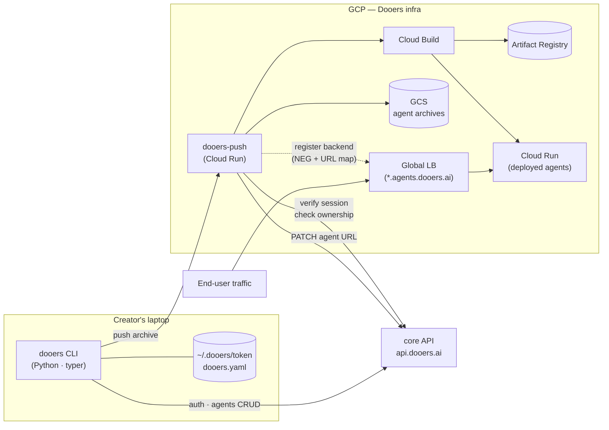
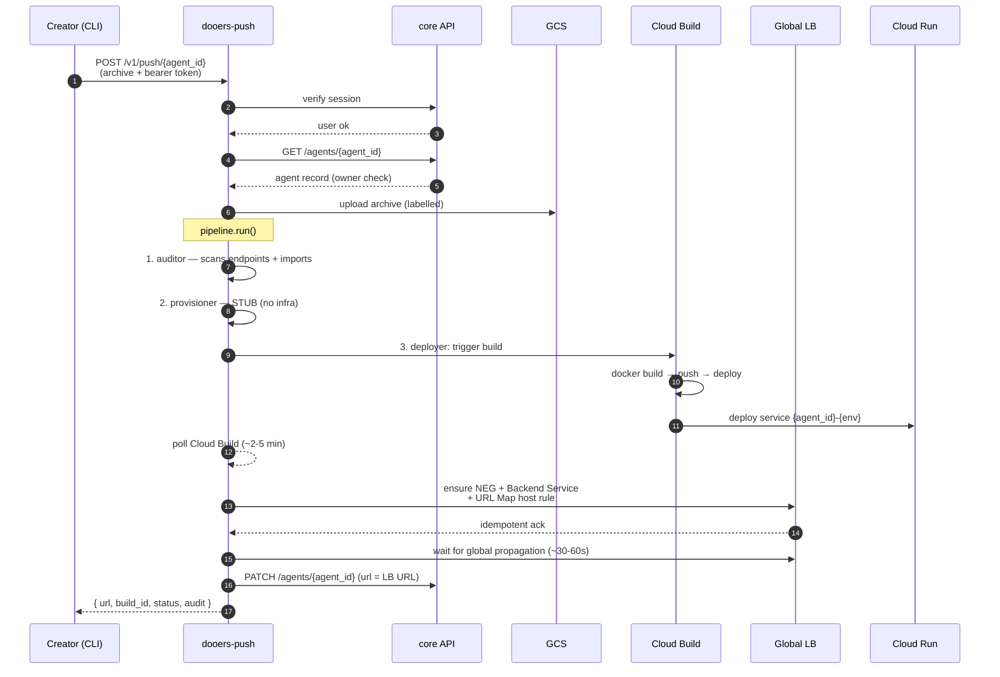

# Dooers CLI v2 — POC Status

**Audience:** Stakeholders / product / leadership
**Status:** Implementation complete (M1–M4 + LB integration). Gated on platform team for one-time GCP setup and live demo.
**Last updated:** 2026-05-27

---

## TL;DR

The Dooers CLI v2 lets an agent creator, from a single terminal, authenticate against Dooers, register agents, and run `dooers push` to ship a container that ends up live at a stable `*.agents.dooers.ai` URL — without ever touching the GCP console.

All four planned milestones (M1 auth → M2 agents CRUD → M3 push round-trip → M4 visible auditor) and the load-balancer integration are **implemented, tested, and pushed**. 58 tests pass across the three packages. The only remaining step before a live demo is a ~45-minute one-time GCP setup that the platform team can execute from a runbook.

The harder open questions you raised — auditor maliciousness rules, managed DB/Redis isolation, billing — are **deliberately deferred** and ship as typed stub steps in the pipeline. Each has a clean integration point so the real implementation can drop in later without touching the rest of the system.

---

## What the creator does (terminal walkthrough)

```bash
# 1. Authenticate once (token saved to ~/.dooers/token)
$ dooers auth login --email creator@example.com
Requesting verification code…
Verification code sent to your email.
Enter the code: 482931
Authenticated.

# 2. List the agents I own
$ dooers agents list
ID            NAME                            STATUS      URL
ag_8h2k       customer-support                deployed    https://ag-8h2k.agents.dooers.ai
ag_3m1p       invoice-parser                  draft       —

# 3. Create a new agent record (writes dooers.yaml in cwd)
$ cd ~/code/my-new-agent
$ dooers agents create --name my-new-agent
Created ag_7q4r. dooers.yaml written.

# 4. Push the code — archive, audit, build, deploy, register in LB, return URL
$ dooers push
Archiving …
Archive: dooers-abc.tar.gz (2.4 MB)
Pushing ag_7q4r (this can take 3-5 min) /

Audit: 1 endpoint(s) detected:
  - /

Live at: https://ag-7q4r-dev.agents.dooers.ai
```

That's the entire creator experience. Production URLs (when `--env=prod`) drop the env suffix, so production agents land at `https://ag-7q4r.agents.dooers.ai`.

---

## How it works (architecture)



**Three boundaries to keep in mind:**

1. **The CLI talks to two services only:** `core API` (auth + agent metadata) and `dooers-push` (the push pipeline). Nothing else.
2. **`dooers-push` does not own agent records.** It reads from core to verify ownership and writes only the deployed URL back. The source of truth for agents stays in core.
3. **`dooers-protocol`** is a tiny shared package that defines every request/response shape between the CLI and `dooers-push`. They cannot drift out of sync — schema changes break the build on both sides simultaneously.

---

## What happens during `dooers push`



The CLI shows a spinner during steps 7–13; total wall time is dominated by Cloud Build (~3 min for a typical agent) plus ~30s for LB propagation.

---

## POC scope: what shipped, what's still deferred

| Capability | POC | Deferred | Notes |
|---|:-:|:-:|---|
| CLI: `auth login / whoami / logout` | ✅ | | OTP-via-email flow; token at `~/.dooers/token` (0600) |
| CLI: `agents list / create / show` | ✅ | | Backed by FileShim until core's `/agents` endpoints exist; one-env-var switch when they do |
| CLI: `push [<agentID>]` | ✅ | | Reads `dooers.yaml` if no agentID; `.dooersignore` ported from v1 |
| Archive → GCS → Cloud Build → Cloud Run | ✅ | | Ported from v1; resources labelled with `agent_id` + `owner_user_id` + `env` |
| Synchronous push, returns live URL | ✅ | | Server polls Cloud Build (~3-5 min); CLI shows spinner |
| Write deployed URL back to agent record | ✅ | | `PATCH /agents/{id}` (no-op in shim mode) |
| Auditor — scans archive, surfaces endpoints + imports | ✅ | | Never blocks; visible in CLI output |
| Provisioner step (typed interface, no-op) | ✅ stub | | Clean seam for managed DB/Redis later |
| **Load balancer integration** | ✅ | | Global HTTPS LB; per-agent Serverless NEG + Backend Service + URL Map rule, all idempotent |
| `*.agents.dooers.ai` stable URLs | ✅ | | Prod: `ag_7q4r.agents.dooers.ai`. Dev/staging: `ag-7q4r-dev.agents.dooers.ai`. Single wildcard cert. |
| Billing-ready labels on GCP resources | ✅ | | `agent_id` + `owner_user_id` + `env` on GCS objects, Cloud Build tags, Cloud Run labels |
| Real auditor (maliciousness rules) | | 🔜 | Research + policy problem; see open questions |
| Managed DB per agent | | 🔜 | Isolation-model decision pending; see open questions |
| Managed Redis per agent | | 🔜 | Same as DB |
| Managed RAG / LLM token reseller | | 🔜 | Separate product surface |
| Custom domains per agent (BYO) | | 🔜 | Post-POC |
| Async push (build-id + status polling) | | 🔜 | POC stays synchronous; simpler demo |
| Billing meter | | 🔜 | Labels are in place; meter is a follow-up spec |
| `dooers agents delete` | | 🔜 | The `LBManager.unregister_agent` API exists; CLI command not exposed |
| `dooers logs / rollback / env` (Day-2 ops) | | 🔜 | Post-POC spec |

**Implementation status, by milestone tag (pushed to `Dooers-ai/dooers-cli` `main`):**

| Tag | What it covers | Status |
|---|---|---|
| `m1-auth` | Settings, TokenStore, CoreClient auth, auth subcommands | ✅ Pushed |
| `m2-agents` | AgentStore + FileShim + HTTPCore, dooers.yaml, agents subcommands | ✅ Pushed |
| `m3-push` | CLI push + dooers-push pipeline + LB integration | ✅ Pushed |
| `m4-audit` | Auditor surfaces endpoints + imports | ✅ Pushed |

---

## Stakeholder open questions — how the POC handles them

You flagged three deep questions. The POC does not solve any of them, but it **does not block** any of them either. Each has a clean integration point.

### 1. DB/Redis isolation (shared vs partitioned vs per-agent)

**POC posture:** The provisioner step is a **typed no-op**. Agents in the POC that need a database connect to one they configure themselves via env vars (just like v1).

**Why deferred:** Picking the isolation model is a multi-day design exercise with permanent consequences (shared instance with schema-per-agent vs DB-per-agent vs instance-per-agent vs partnering with a managed provider like Neon). The trade-offs intersect with the customer profile, cost floor, and per-agent isolation requirements — all business decisions.

**Recommendation (from internal research, separate from this spec):** Partner with Neon (or Supabase) for managed Postgres, the same way Vercel does. Skip building your own DB-per-agent on Cloud SQL unless paying customers force the issue. Skip managed Redis entirely until proven demand.

**Clean seam:** When the decision lands, the only code that changes is `packages/dooers-push/src/dooers_push/pipeline/provisioner.py` and the `InfraManifest` type in `dooers-protocol`. The CLI and rest of the pipeline don't move.

### 2. Code auditor — what counts as malicious?

**POC posture:** The auditor scans Python archives for endpoint route decorators and top-level imports, and surfaces them in the `AuditReport`. **It never blocks deploys.** That's the demoable seam: stakeholders can see "here are the 12 endpoints and 7 imports the auditor found" without committing to a policy.

**Why deferred:** "Malicious" is a policy decision, not a code change. Real auditing needs a taxonomy (data exfiltration, credential theft, crypto mining, prompt-injection of other Dooers agents), a signal source (static AST analysis, LLM-based code review, dependency-graph CVE scanning), and a response policy (block, warn, quarantine, manual-review queue).

**Decision input needed:** which categories block deploy vs warn vs notify; who reviews flagged code; SLA on review.

**Clean seam:** `pipeline/auditor.py` and the `AuditReport`/`AuditFinding`/`InfraManifest` types. The interfaces are committed; real implementation drops in without changing any caller.

### 3. How do we charge?

**POC posture:** No billing meter yet. But **every GCP resource the POC creates is labelled with `agent_id`, `owner_user_id`, and `env`** from day one (Cloud Run service labels, Cloud Build tags, GCS object metadata, Artifact Registry repo tags). Once a billing model is chosen, the cost data attribution is already in place.

**Why deferred:** Billing model choice is a business decision (cost-plus? flat per-agent? tiered by traffic? metered LLM tokens?), not an engineering one. Building the meter before the model is wasted work.

**Decision input needed:** billing axis (request count? CPU-second? per-agent flat fee? LLM tokens?), invoice cadence, free tier.

**Clean seam:** GCP cost-export → BigQuery → aggregation by label. No code in `dooers-push` needs to change to add billing later.

---

## What's needed before the live demo

The code is shipped. To run an end-to-end demo against the dev environment, the platform team needs to execute these one-time setup steps:

1. **Run `docs/devops/gcp-lb.md`** — ~45 minutes of clicks (or `gcloud` if you prefer) plus a 30-60 minute wait for the Google-managed SSL certificate to provision. The runbook is self-contained: reserve a static IPv4, create the wildcard cert for `*.agents.dooers.ai`, create the URL Map + Target HTTPS Proxy + Forwarding Rule, deploy a placeholder 404 service as the default backend, add a wildcard DNS A record, grant `roles/compute.loadBalancerAdmin` to the `agent-deploy-service` service account.

2. **Deploy `dooers-push` to dev Cloud Run.** Image builds from `packages/dooers-push/Dockerfile`. Service account: `agent-deploy-service@<PROJECT_ID>.iam.gserviceaccount.com`. Required env: `GCP_PROJECT_ID`, `BUCKET_NAME`, `CORE_API_URL` (defaults to prod core; override to `https://api.dev.dooers.ai` for the demo).

3. **Confirm core API endpoints** for agents CRUD. The CLI ships with a `FileShimAgentStore` fallback (lives in `~/.dooers/agents.json`) so the demo can run **even without core's `/agents` endpoints existing**. When the backend team is ready, `DOOERS_USE_CORE_AGENTS=1` switches the CLI to talk to core directly. No client redeploy required.

4. **Run the manual E2E** (described in `docs/superpowers/plans/2026-05-27-dooers-lb-integration.md` Task L.13): create a test agent, push, verify the URL is `*.agents.dooers.ai` and resolves, confirm idempotency on re-push.

Once those four steps are done, the demo is reproducible end-to-end.

---

## What's next after the POC demo

| Priority | Item | Type |
|---|---|---|
| High | Core API `/agents` endpoints (if not done yet) | Backend work |
| High | Day-2 ops in CLI: `dooers logs`, `dooers rollback`, `dooers delete` | Eng spec + impl |
| Medium | Real auditor — pick a starting policy (scan + warn, no blocking) | Product + Eng |
| Medium | Managed DB story — pick partner (Neon) or build-it path | Product + Eng |
| Medium | Async push + status command (CLI no longer blocks 3-5 min) | Eng |
| Low | ErrorEnvelope rollout across remaining endpoints | Eng polish |
| Low | Terraform for platform infra | Eng polish |
| Low | Per-agent custom domains | Eng |

---

## Documentation references

- **Implementation plans** (task-by-task, with code):
  - `docs/superpowers/plans/2026-05-26-dooers-cli-v2-poc.md` — M1-M4 base plan
  - `docs/superpowers/plans/2026-05-27-dooers-lb-integration.md` — LB integration plan
- **Design specs:**
  - `docs/superpowers/specs/2026-05-26-dooers-cli-v2-design.md` — full implementation spec
  - `docs/superpowers/specs/2026-05-27-dooers-lb-design.md` — LB design spec
- **DevOps runbook:**
  - `docs/devops/gcp-lb.md` — one-time GCP setup (45 min)
- **Repo:** [`Dooers-ai/dooers-cli`](https://github.com/Dooers-ai/dooers-cli) on `main`

---

*This overview is the stakeholder-facing companion to the implementation plans and design specs.*
